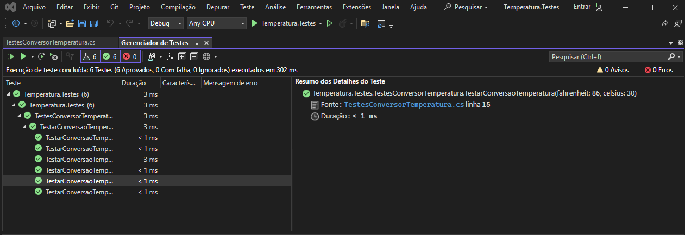
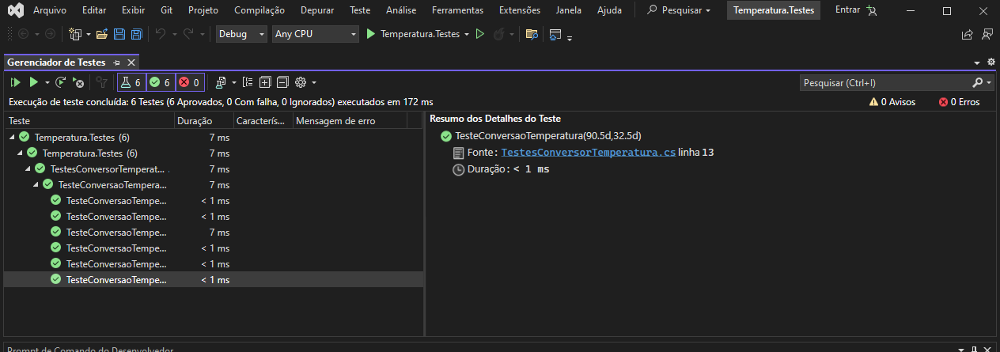
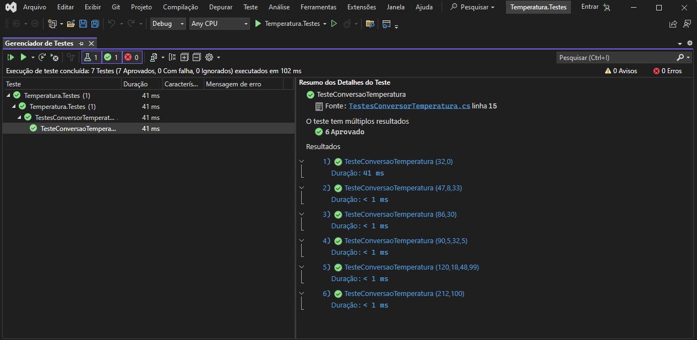
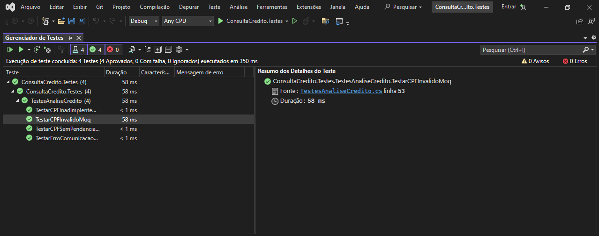
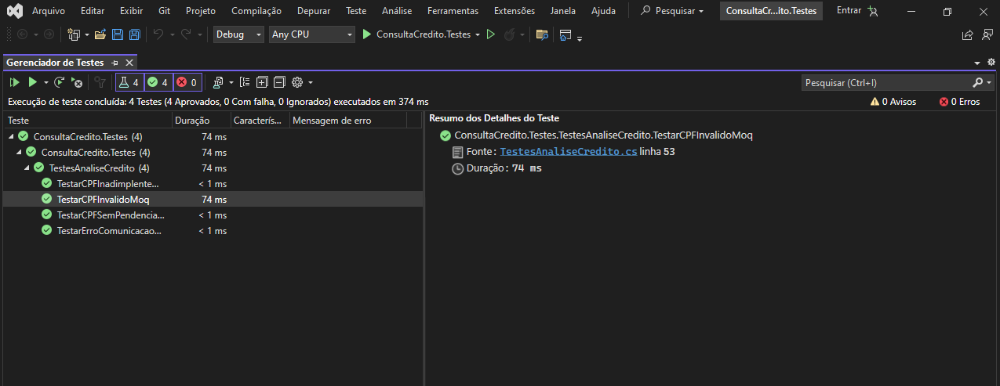
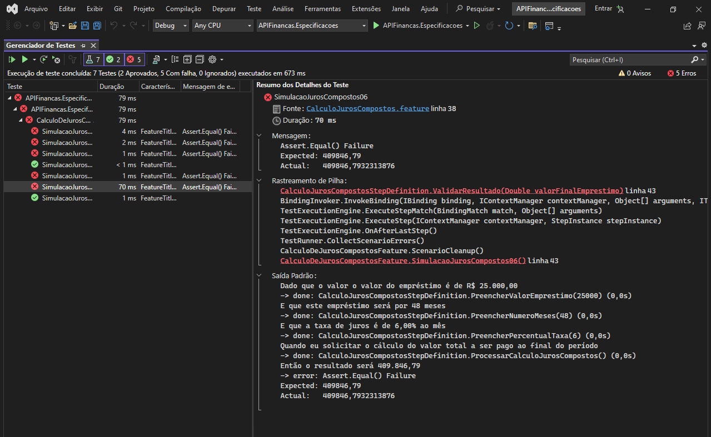

# Ponderada M10 S6: Testes em .NET 5 - exemplos de utilização.

## Teste unitário: Conversão de temperatura
Foram selecionados 6 grupos de valores para testar o algoritmo de conversão de temperatura. Foi informado o valor em Celsius esperado e o valor em Fahrenheit, e o retorno da função deve ser o valor em Celcius informado.

### .NET 5 + Unit Testing + xUnit + Conversão de Temperaturas
O arquivo Temperatura/ConversorTemperatura.cs contém a classe ConversorTemperatura que possui um método estático FahrenheitParaCelsius para converter a temperatura de Fahrenheit para Celsius. A fórmula usada é: (temperatura - 32) / 1.8.

O arquivo Temperatura.Testes/TestesConversorTemperatura.cs contém a classe TestesConversorTemperatura que utiliza o framework xUnit para realizar os testes. Nesse exemplo, são testados diversos valores de Fahrenheit e seus correspondentes em Celsius. O teste verifica se o método FahrenheitParaCelsius retorna o valor esperado.

### .NET 5 + Unit Testing + NUnit + Conversão de Temperaturas

Aqui, os testes implementados são do tipo TestCase, que são usados para validar a conversão de temperatura de Fahrenheit para Celsius. TestCase: cada TestCase fornece um conjunto de valores de entrada e o resultado esperado. 

Por exemplo, 32°F deve ser igual a 0°C. Método TesteConversaoTemperatura: esse método executa o teste, chamando a função FahrenheitParaCelsius da classe ConversorTemperatura com o valor em Fahrenheit e verifica se o resultado em Celsius está correto usando Assert.AreEqual.

### .NET 5 + Unit Testing + MSTest + Conversão de Temperaturas
O método de teste é TesteConversaoTemperatura, anotado com DataTestMethod, que permite a execução do teste com diferentes conjuntos de dados. Cada conjunto de dados é fornecido através do atributo DataRow, especificando pares de valores de temperatura em Fahrenheit e Celsius. 

O método TesteConversaoTemperatura recebe dois parâmetros: tempFahrenheit e tempCelsius, convertendo a temperatura de Fahrenheit para Celsius usando o método ConversorTemperatura.FahrenheitParaCelsius. Depois, a conversão é verificada usando Assert.AreEqual, comparando o valor calculado com o valor esperado (tempCelsius).

## Teste unitário: Fluent Assertions
Foram configurados diferentes comportamentos do mock para CPFs específicos, simulando respostas variadas (por exemplo, CPF inválido, erro de comunicação, sem pendências, inadimplente). Cada teste utiliza o FluentAssertions para garantir que o status retornado corresponde ao esperado, fornecendo mensagens de erro claras caso os resultados não coincidam.

### .NET 5 + xUnit + Moq + Fluent Assertions
Para cada cenário de CPF, um teste específico foi criado para verificar se o sistema retorna o status correto:
- CPF inválido: verifica se o sistema retorna StatusConsultaCredito.ParametroEnvioInvalido.
- Erro de comunicação: verifica se o sistema retorna StatusConsultaCredito.ErroComunicacao.
- CPF sem pendências: verifica se o sistema retorna StatusConsultaCredito.SemPendencias.
- CPF inadimplente: verifica se o sistema retorna StatusConsultaCredito.Inadimplente.

### .NET 5 + xUnit + NSubstitute + Fluent Assertions
Um mock da interface IServicoConsultaCredito foi criado utilizando a biblioteca NSubstitute. Quatro casos de teste foram configurados para retornar diferentes resultados para a consulta de pendências por CPF:
- CPF_INVALIDO: retorna null.
- CPF_ERRO_COMUNICACAO: lança uma exceção.
- CPF_SEM_PENDENCIAS: retorna uma lista vazia.
- CPF_INADIMPLENTE: retorna uma lista com uma pendência específica.

Além disso, o método ObterStatusAnaliseCredito foi criado para obter o status da análise de crédito chamando o método ConsultarSituacaoCPF da classe AnaliseCredito.

Foram definidos quatro casos de teste utilizando a biblioteca xUnit: TestarCPFInvalidoMoq, TestarErroComunicacaoMoq, TestarCPFSemPendenciasMoq e TestarCPFInadimplenteMoq

## Teste unitário: SpecFlow
O SpecFlow é uma alternativa open source muito útil quando optamos por abordagens como BDD (Behavior Driven Development), possibilitando a execução de testes de validação de funcionalidades de um projeto através de user stories. 

Ao executar os testes, cada um dos dados mapeados dos cenários é lido, e é validado se o resultado recebido é o mesmo do resultado mapeado no cenário.

### ASP.NET Core 5 + REST API + xUnit + SpecFlow + Swagger + Dockerfile + Juros Compostos
- Arquivo de Especificação (Feature File):
CalculoJurosCompostos.feature define diferentes cenários de teste para calcular os juros compostos de empréstimos. 

- Código Gerado (Feature Code):
O arquivo CalculoJurosCompostos.feature.cs é gerado automaticamente pelo SpecFlow e contém a infraestrutura necessária para executar os testes definidos no arquivo de especificação. 

- Definição dos Passos (Step Definitions):
O arquivo CalculoJurosCompostosStepDefinition.cs contém a implementação dos passos descritos nos cenários de teste. 

